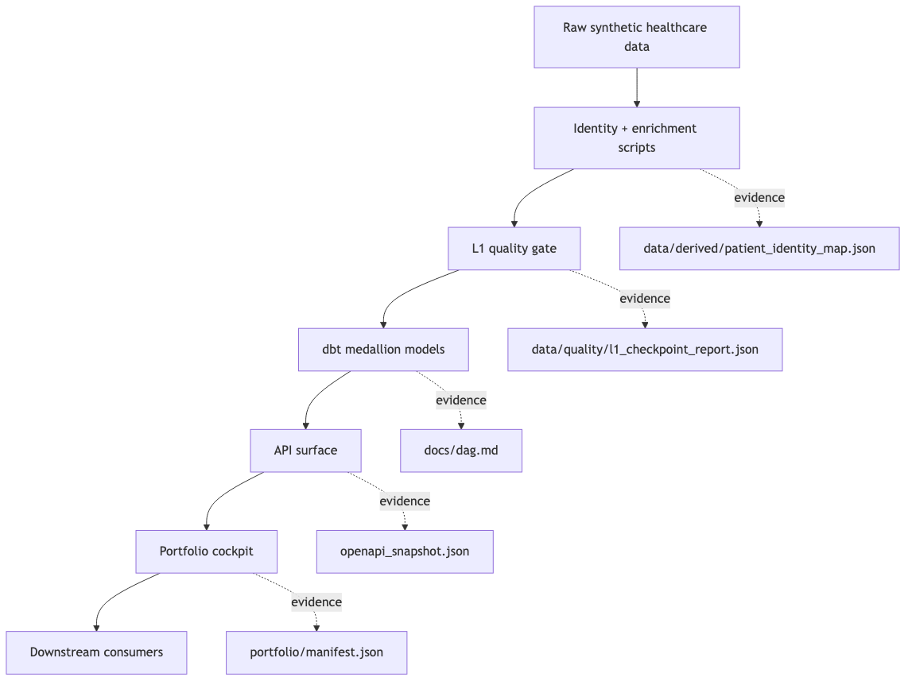

# healthcare-ai-data-engineer

> 🟥 **L1 Truth + 🟧 L1.25 Context** part of the [L1→L3 healthcare AI platform](https://gozeroshot.dev) — Truth → Features → Signals → Actions → Human adoption. This repo = the trusted warehouse + Feast feature store everything downstream consumes.

Trusted healthcare data backbone for AI Data Engineer work — with an L2
grounded-agent layer that answers questions **only** from the trusted marts,
and a human cockpit where every displayed number links to the file that proves it.


**Live cockpit (A1–A6):** https://healthcare-ai-data-819957310168.us-west1.run.app/app
&nbsp;·&nbsp; **API docs:** [/docs](https://healthcare-ai-data-819957310168.us-west1.run.app/docs)
&nbsp;·&nbsp; **Grounded agent:** [`/api/ask?q=…`](https://healthcare-ai-data-819957310168.us-west1.run.app/api/ask?q=which%20patients%20show%20cardiac%20red%20flags)

Built for hiring managers who want proof, not adjectives. **Every number on the
cockpit traces to a test or a committed artifact — not a vibe.**

---

## Architecture



Raw synthetic data → identity + enrichment → **L1 quality gate** → dbt medallion
marts → FastAPI on Cloud Run → consumed by **humans** (A1/A2 cockpit) and
**agents** (BM25 retrieval + grounded Gemini, redacted surfaces only).

---

## Repo Map

What lives where, at a glance:

```
healthcare-ai-data-engineer/
├── api/                              the live FastAPI service
│   ├── app/
│   │   ├── main.py                   ✅ entry point — wires routes + serves the A1–A6 cockpit
│   │   ├── ask.py                    ✅ the /api/ask grounded-agent answer logic
│   │   ├── retrieval.py              ✅ BM25 — pulls the records that match the question
│   │   ├── classifier.py             ✅ tags each encounter (ESI tier / red-flag)
│   │   ├── control_room.py           ✅ builds the A1 executive dashboard numbers live
│   │   ├── trust_room.py             ✅ builds the A2 trust / data-quality panel live
│   │   └── warehouse_room.py         ✅ builds the A5 warehouse-inventory panel live
│   ├── requirements.txt              ✅ API-only deps
│   └── README.md                     📖 how the API layer works
├── dbt-project/                      the warehouse (raw → clean → gold)
│   ├── models/staging/               ✅ stg_healthcare + sources — raw landing
│   ├── models/intermediate/          ✅ enriched encounters + readmission logic
│   ├── models/marts/core/            ✅ 8 dims + fact_patient_encounters (the gold tables)
│   ├── tests/                        ✅ 3 SQL data tests (no negative LOS, discharge>admit…)
│   ├── dbt_project.yml · profiles    ✅ dbt config
│   └── README.md                     📖 how the marts are built
├── feature-store/                    the L1.25 feature layer
│   ├── features.py                   ✅ Feast feature definitions (point-in-time correct)
│   ├── feature_store.yaml            ✅ Feast config (BigQuery offline / sqlite online)
│   ├── requirements.txt              ✅ feast[gcp] — kept out of the API image
│   └── README.md                     📖 what the features are + how to apply them
├── scripts/                          one-shot pipeline jobs (run by hand / CI)
│   ├── checkpoint.py                 ✅ the L1 data-quality gate (7 checks)
│   ├── patient_identity.py           ✅ rolls encounters up to stable patient IDs
│   ├── enrich_clinical_narrative.py  ✅ adds Vertex-generated clinical text
│   ├── enrich_parallel.py            ✅ the real 500-row parallel enrich run
│   ├── load_bigquery.py              ✅ loads the marts into BigQuery
│   ├── stratified_sampler.py         ✅ picks a representative slice
│   ├── split_holdout.py              ✅ carves out an eval hold-out set
│   ├── build_portfolio_snapshot.py   ✅ regenerates the A1/A2/A5 dashboard payloads
│   └── edge_cases.json               ✅ tricky inputs the scripts guard against
├── tests/                            pytest — proves it all works
│   ├── test_api.py · test_ask.py     ✅ API + grounded-agent answers
│   ├── test_checkpoint.py            ✅ the quality gate catches bad data
│   ├── test_control_room.py          ✅ dashboard numbers are correct
│   ├── test_identity.py              ✅ patient identity rollup is correct
│   ├── test_retrieve_classify.py     ✅ retrieval + classifier behave
│   └── test_feature_store.py         ✅ the L1.25 feature definitions are valid
├── data/
│   ├── quality/                      ✅ checkpoint report + eval/golden sets (the proof JSONs)
│   └── derived/patient_identity_map  ✅ the resolved encounter→patient map
├── docs/                             📖 contracts.md · dag.md · L1_HARDENING.md (the "why")
├── portfolio/                        🖼️  A1–A6 — one folder per cockpit panel
│   ├── A1…A6/screenshots/*.png       🖼️  proof shots of each live panel
│   ├── A1…A6/*_ascii.md · *.md       📖 panel notes + ASCII mockups
│   ├── A1/A2/A5/*_payload.json       🖼️  captured dashboard data behind each shot
│   └── A6/architecture.png           🖼️  the system diagram used up top
├── web/                              ✅ index.html · app.js · styles.css (the static cockpit)
├── deploy/cloudrun.sh · Dockerfile   ✅ how it ships to Cloud Run
├── demo/quickstart.sh                ✅ clone-to-running in one script
├── .github/workflows/quality.yml     ✅ CI — runs the quality gate + tests on push
├── openapi_snapshot.json             ✅ frozen public API surface
├── Makefile                          ✅ test · feast-apply · serve · checkpoint
├── requirements*.txt                 ✅ app deps (deploy split out, leaner image)
├── LOOKER_STUDIO.md · *.md           📖 BI / setup notes
└── demo.gif · README.md              🖼️📖 the 10-second story
```

---

## 60-Second Read

- 55,500 synthetic encounters modeled through dbt bronze/silver/gold layers.
- 497-row enriched slice shipped with a passing **7/7 L1 quality gate**, 0 critical failures.
- 55,500 encounters resolved into 40,235 unique patient identities (47 synthetic edges flagged).
- Published contracts + frozen OpenAPI snapshot keep the surface stable.
- **L2 grounded agent** (`/api/ask`): BM25 retrieves top-K from the redacted enriched corpus,
  then Gemini answers with `[doc N]` citations — no raw PII indexed.

If you open only three files, open these:

- [data/quality/l1_checkpoint_report.json](data/quality/l1_checkpoint_report.json) — the trust gate that passed
- [data/derived/patient_identity_map.json](data/derived/patient_identity_map.json) — encounter → patient resolution
- [docs/contracts.md](docs/contracts.md) — the stable contracts downstream consumes

**Honest scope:** synthetic lab/demo corpus with a real dbt model, tested DAG, and identity-resolution
proof — *not* a HIPAA-compliant production EHR or authenticated multi-tenant SaaS.

---

## Quick Start

```bash
git clone https://github.com/anix-lynch/healthcare-ai-data-engineer
cd healthcare-ai-data-engineer
make install
bash demo/quickstart.sh
```

Then run the API:

```bash
make serve
curl localhost:8000/api/stats | jq
```

Common commands:

```bash
make checkpoint    # run the 7-check L1 quality gate
make patient-id    # rebuild encounter -> patient identity map
make test          # run pytest
```

---

## Related Repos

This repo is the backbone — it publishes the data product; the others consume it.

- [healthcare-genai-engineer](https://github.com/anix-lynch/healthcare-genai-engineer) — L2 GenAI consumer layer
- [healthcare-forward-deployed-engineer](https://github.com/anix-lynch/healthcare-forward-deployed-engineer) — FDE delivery layer
- [healthcare-genai-fullstack](https://github.com/anix-lynch/healthcare-genai-fullstack) — full three-layer system
- [healthcare-api](https://github.com/anix-lynch/healthcare-api) — richer mirror with more script history

---

## License

MIT.
